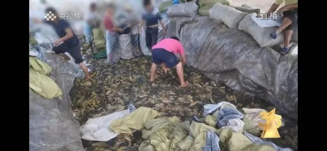

# 接力报315素材

3月15日，央视“315”晚会谈及食品安全违法违规行为，点名插旗菜业、锦瑞食品。

据了解，插旗菜业为多家企业代加工酸菜制品，但在生产卫生等方面对于出口和内销的老坛酸菜产品存在严重的“双标”情况。

据央视“315”晚会曝光，插旗菜业标准化腌制池腌出来的酸菜是用来加工出口产品的，而内销的老坛酸菜包里的酸菜则是从外面收购来的“土坑酸菜”。同样，锦瑞食品也直接从外面收购“土坑酸菜”，再经过坛子七天发酵等多道工序，使得原本存在的树枝、田螺、羽毛、烟蒂等杂质肉眼难见。

何为“土坑酸菜”？根据央视曝光视频，“土坑酸菜”生产场地为土坑，没有任何安全保障，卫生状况堪忧，工人在没有任何卫生措施的情况下，有的穿着拖鞋，有的光着脚，踩在酸菜上，就连称量酸菜的磅秤也是直接放到酸菜上。有的工人甚至一边抽烟一边干活，抽完的烟头直接扔到酸菜上。这些酸菜在被企业收购时，并不对卫生指标进行检测。

